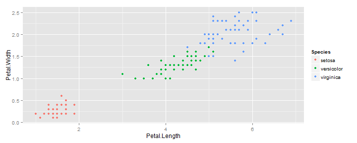
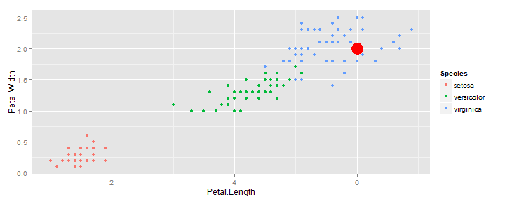

## Introduction

<p>This app displays an interactive plot of variables in the iris dataset.  It has two major functions:</p>
1. Like a pairs plot, you can quickly view the plot of any combination of two variables in the dataset
2. You can input a new data point, which will be shown on the plot, and predict the species the point would belong to based on a tree model 

--- .class #id 

## Changing the plot view

- The app will show a plot like this, with the variables chosen by buttons on the sidebar

```r
library(ggplot2)
data(iris)
g <- ggplot(iris, aes(Petal.Length,Petal.Width,color=Species)) + geom_point()
g
```

 
- The x and y parameters are dynamically set whenever one of the selection widgets is changed

---

## Predicting with user input

- You can also input a set of values for the iris variables and predict the species from a simple CART model
- The plot will show the point with the given values, allowing you to visually compare the prediction to the points on the plot
- The display will look like this, but with user input instead of hard-coded values

```r
iris2 <- iris[0, ]
iris2[1, ] <- c(6,2,6,2,as.factor("species"))
g2 <- g + geom_point(data=iris2, color="red", size=8)
g2
```

 

---

## Possible future ideas

<p>There are various improvements I would consider adding with more time:</p>
- More control of the prediction settings, display of output like classification trees 
- Other display options on the plot (eg. regression lines, R^2)
- If possible, I would want to allow the user to choose the dataset, and dynamically create the selection widgets


